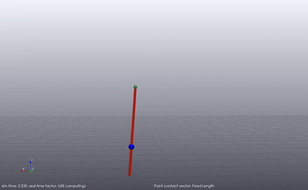

## About 

This repository contains code for trajectory optimization using Differential Dynamic Programming (DDP) 
and Iterative LQR (iLQR) in [Drake](https://drake.mit.edu/), with a particular focus on optimization
through [hydroelastic](https://drake.mit.edu/doxygen_cxx/group__hydroelastic__user__guide.html) contact. 

This code accompanies the paper *Contact-Implicit Trajectory Optimization with Hydroelastic Contact and iLQR*
by Vince Kurtz and Hai Lin, [https://arxiv.org/abs/2202.13986](https://arxiv.org/abs/2202.13986).

## Installation

Install the dependencies:
- Python 3
- Numpy
- [Drake](https://drake.mit.edu/installation.html)

Clone the repository:
```
git clone https://github.com/vincekurtz/drake_ddp/
```

Run the examples (see details below), e.g.,
```
python cart_pole_with_wall.py
```

## Examples

Meldis (`python -m pydrake.visualization.meldis`) must be running to view the generated trajectories. Further parameters can be found in each python script. 

Code for running iLQR over arbitrary discrete-time Drake `System` objects is provided in [`ilqr.py`](ilqr.py). 

### No Contact

These examples are simple benchmark control systems. iLQR can be compared with the direct transcription method for each of these examples: see the parameters in each python script for details. 

[`pendulum.py`](pendulum.py): simple swing-up control of an inverted pendulum.



[`acrobot.py`](acrobot.py): swingup control of an underactuated acrobot. Performs 50 receding-horizon resolves in the spirit of model predictive control (MPC). 


[`cart_pole.py`](cart_pole.py): stabilize a cart-pole system around the upright operating point. 


### Hydroelastic Contact

These are more complex examples that require making and breaking contact. Contact sequences are determined automatically by iLQR. Drake's AutoDiff capabilities are used to generate dynamics gradients, which can be slow.

[`cart_pole_with_wall.py`](cart_pole_with_wall.py): stabilize a cart-pole system around the upright operating point, with the help of a nearby wall.


[`kinova_gen3.py`](kinova_gen3.py): Perform whole-arm manipulation of a large ball using a Kinova Gen3 manipulator. 


[`mini_cheetah.py`](mini_cheetah.py): Automatic gait generation for a quadruped robot. Move the MIT Mini Cheetah forward at a desired velocity. Performs 100 receding-horizon resolves in the spirit of MPC. 


## Derivative Interpolation
To speed up the trajectory optimisation for these models, dynamics gradient interpolation has been added from the paper "adaptive approximation of dynamics gradients via interpolation for speeding up trajectory optimization" by David Russell, Rafael Papallas and Mehmet Dogar, (https://eprints.whiterose.ac.uk/197059/1/ICRA23_0389_FI.pdf).

Computing the dynamics gradients over a trajectroy (fx and fu matrices) is computationally expensive and is the bottleneck for all these tasks, especially as the models dimensionality increases and the dynamics become more complicated.

Instead of computing the dynamics gradients over the entire trajectory, you can compute them at "key-points" and linearly interpolate approximations in between. The result of this is significantly decreased optimisation times with a small sacrifice in the final solution quality.


There are three inteprolation methods in this repository. (N.B: Set-interval and Adaptive-jerk are covered in the linked paper, iterative error is a new experimental method that will appear in a future publication)

### Set-interval
The Set-interval method has one parameter (minN)

The Set-interval method is the simplest.The key-points are equally spaces with an interval of minN inbetween them.

### Adaptive-jerk
The Adpative-jerk method has three parameters (minN, maxN, jerk_threshold)

The Adaptive-jerk method calcualtes the jerk over the trajectory for all the dofs in the state vector. Whenever the jerk threshold is exceeded, the time-step is marked as a "key-point".  New key-points cant be placed within minN steps of another. If the jerk_threshold isnt exceeded within maxN time-steps, another key-point is placed automatically.

### Iterative error
The Iterative-error method has two parameters (minN, error_threshold)

The iterative error method works very similarly to adaptive-size cell decomposition (A common path-planning algorithm). It starts out with a bad approximation and iteratively improves it until all segments are below a certain error threshold. 

It starts with a bad linear approximation (just using the fist and last time-steps). It then checks the middle of the interpolation, by comparing the difference between the true derivatives (computed via autodiff) and the approximated derivatives (computed via linear interpolartion). The error is computed between these matrices (by calculating the mean squared difference of all values in the matrix). If the error is below the error_threshold then the approximation is good. If the approximation is above the threshold, the algorithm further subdivides that section into smaller sections and repeats this process.

This iterative process is repeated until all segments satisfy the error requirement or the minN interval is reached.

